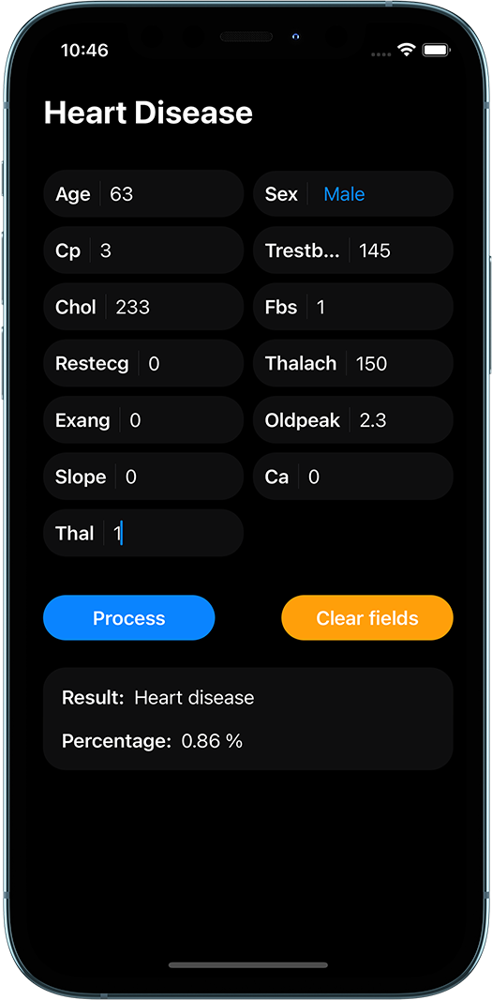

# iOS Portfolio

## USDZ 3D Viewer

This USDZ 3D Viewer was created with SwiftUI, you can view your 3D USDZ models, change the background and change the lighting.

<a href="https://apps.apple.com/us/app/usdz-3d-viewer/id1587642013#?platform=iphone">Go to App Store</a>

---

## Observatory Presentation

Observatory Presentation was created with SwiftUI for macOS, you can create minimalist presentations by adding text, 3d models, images and videos.

<a href="https://apps.apple.com/us/app/observatory-presentation/id1585725474">Go to App Store</a>

---

## Note Thread

This note app was created with SwiftUI, you can create a note, edit note, delete note, check notes, select by categories and sort by checked and unchecked.

<a href="https://apps.apple.com/us/app/note-thread/id1583119687">Go to App Store</a>

---

## Blog App SwiftUI

This blog app was created with SwiftUI, you can create posts and it has authentication.

<a href="https://github.com/Ariel0123/blogApp">Go to GitHub Repository</a>

---

## Pokedex

The Pokedex application was created with SwiftUI, it retrieves pokemons from a rest API with images, abilities and evolutions.

<a href="https://github.com/Ariel0123/pokedexApp">Go to GitHub Repository</a>

---

## Heart Disease App

Heart disease app was created with SwiftUI, uses a Core ML model trained with kaggle's heart disease dataset, which predicts heart disease.

<a href="https://github.com/Ariel0123/HeartDiseaseApp">Go to GitHub Repository</a>

---

## Blog App UIKit

This blog app was created with Swift UIKit, you can create posts.

<a href="https://github.com/Ariel0123/blog_UIKit">Go to GitHub Repository</a>

---

